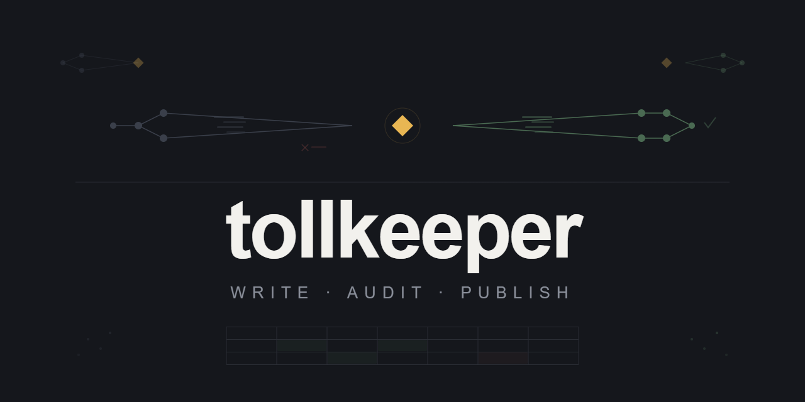

<p align="center">
  
</p>

<p align="center">
  <a href="https://github.com/de-platform-ops/tollkeeper/actions/workflows/ci.yml"></a>
  <a href="https://www.python.org/downloads/"></a>
  <a href="LICENSE"></a>
</p>

A Python library that implements the **Write-Audit-Publish** pattern for data pipelines. Stage writes in isolation, run data quality checks, and promote to production only when checks pass.

---

## Table of Contents

- [Why Tollkeeper?](#why-tollkeeper)
- [Features](#features)
- [Installation](#installation)
- [Quick Start](#quick-start)
- [How It Works](#how-it-works)
- [Data Quality Checks](#data-quality-checks)
- [Backends](#backends)
- [Signal Store](#signal-store)
- [SQL Lineage Parser](#sql-lineage-parser)
- [Airflow Integration](#airflow-integration)
- [API Reference](#api-reference)
- [Development](#development)
- [Contributing](#contributing)
- [License](#license)

## Why Tollkeeper?

Data pipelines that write directly to production tables are fragile. A bad upstream transformation can corrupt production data before anyone notices. The Write-Audit-Publish pattern solves this:

```
                       ┌─── DQ pass ───► Publish to production
Raw data ──► Staging ──┤
                       └─── DQ fail ───► Rollback (production untouched)
```

`tollkeeper` codifies this into a Python library with a fluent API, pluggable backends, and optional Airflow integration.

## Features

- **Zero runtime dependencies** in core, optional extras for Polars, Iceberg, sqlglot
- **Fluent API** with method chaining and context manager support
- **Pluggable backends**: CsvBackend, IcebergBackend, or implement your own
- **Pluggable DQ engine**: 5 built-in Polars checks, or bring your own (Pandas, Presto, etc.)
- **Hard and soft failure modes**: halt-and-rollback or publish-with-notification
- **Signal store**: cross-pipeline coordination via SQLite or any DB-API 2.0 database
- **SQL lineage parser**: automatic source/sink extraction from SQL using sqlglot
- **Airflow integration**: `airflow-tollkeeper` package with TollkeeperOperator, TollkeeperSensor, DQ operators, strategy registry

## Installation

```bash
pip install tollkeeper                # core only (zero deps)
pip install "tollkeeper[polars]"       # + Polars DQ checks
pip install "tollkeeper[iceberg]"      # + PyIceberg backend
pip install "tollkeeper[sql]"          # + sqlglot lineage parser
pip install "tollkeeper[all]"          # everything
```

For Airflow integration:

```bash
pip install airflow-tollkeeper
```

Requires Python 3.11+.

## Quick Start

```python
import shutil
from pathlib import Path

from tollkeeper import Tollkeeper, CsvBackend, NullCheck, RowCountCheck

backend = CsvBackend(staging_dir=Path("/tmp/tollkeeper"), publish_dir=Path("/data/output"))

(Tollkeeper(backend)
    .table("sales")
    .write(lambda ref: shutil.copy("upstream_output.csv", ref))
    .audit([NullCheck("id"), RowCountCheck(min_rows=100)])
    .publish())
```

If any check fails, the staged file is rolled back automatically. Production is never touched.

### Context manager

```python
with Tollkeeper(backend).table("sales") as session:
    session.write(lambda ref: shutil.copy("upstream_output.csv", ref))
    session.audit([NullCheck("id")])
    session.publish()
# Auto-rollback on exception or if publish() was never called
```

## How It Works

```
┌──────────────────────────────────────────────────────────────────┐
│                     Tollkeeper Lifecycle                          │
│                                                                  │
│  1. WRITE     Your callback writes to an isolated staging ref    │
│  2. AUDIT     DQ checks run against staged data                  │
│  3. PUBLISH   On pass: staging promoted to production            │
│  4. ROLLBACK  On fail: staging discarded, production untouched   │
└──────────────────────────────────────────────────────────────────┘
```

The lifecycle is backend-agnostic. For CSV files, "staging" is a temp file and "publish" is a rename. For Iceberg, "staging" is a branch and "publish" is a fast-forward merge.

## Data Quality Checks

Five built-in checks using Polars (install with `[polars]` extra):

| Check | Constructor | Passes when |
|-------|-------------|-------------|
| `NullCheck` | `NullCheck("column")` | No nulls in column |
| `RowCountCheck` | `RowCountCheck(min_rows=100)` | Row count >= threshold |
| `ExpressionCheck` | `ExpressionCheck("name", pl.col("age") > 0)` | All rows match the Polars expression |
| `SqlCheck` | `SqlCheck("name", "age > 0 AND score >= 0")` | All rows match the SQL WHERE condition |
| `UniqueCheck` | `UniqueCheck(["region", "date"])` | No duplicate groups on given columns |

### Custom checks

Subclass `BaseCheck` to create checks with any engine:

```python
from tollkeeper import BaseCheck, CheckResult

class SchemaCheck(BaseCheck):
    def __init__(self, expected_columns: list[str]) -> None:
        self._expected = expected_columns

    def run(self, version_ref: str, *, conn=None) -> CheckResult:
        import polars as pl
        df = pl.read_csv(version_ref)
        missing = set(self._expected) - set(df.columns)
        return CheckResult(
            check_name=self.name,
            passed=len(missing) == 0,
            details=f"missing columns: {missing}" if missing else "all columns present",
        )
```

### Soft failures

Publish despite failed checks with an optional notification callback:

```python
session.audit(
    [RowCountCheck(min_rows=1000)],
    on_failure="continue",
    on_notify=lambda table, ref, failed: log.warning(f"{table}@{ref}: {failed}"),
)
```

## Backends

| Backend | Extra | Description |
|---------|-------|-------------|
| `CsvBackend` | none | Local CSV files with staging/publish directories |
| `IcebergBackend` | `[iceberg]` | Branch-based versioning with pointer-swap publish via PyIceberg |
| Custom | none | Implement the `Backend` ABC: `create_version`, `publish_version`, `rollback_version` |

## Signal Store

Coordinate across pipelines by tracking table readiness:

```python
from tollkeeper import Tollkeeper, SqliteSignalStore

signal_store = SqliteSignalStore("/tmp/signals.db")
tk = Tollkeeper(backend, signal_store=signal_store)

# After successful audit+publish, a signal is emitted automatically.
# Downstream pipelines can check:
signal = signal_store.check("sales", {"ds": "2026-01-15"})
```

| Store | Description |
|-------|-------------|
| `SqliteSignalStore` | File-based, zero-config, good for single-machine pipelines |
| `DbApiSignalStore` | Any DB-API 2.0 connection (Postgres, MySQL, etc.) |

## SQL Lineage Parser

Automatically extract source and sink tables from SQL (install with `[sql]` extra):

```python
from tollkeeper import extract_lineage

result = extract_lineage(
    "INSERT INTO warehouse.fact_orders SELECT * FROM staging.raw_orders JOIN dim_date USING (dt)",
    dialect="trino",
)

print(result.sources)  # {'staging.raw_orders', 'dim_date'}
print(result.sinks)    # {'warehouse.fact_orders'}
```

Handles CTEs (excluded from sources), schema/catalog-qualified names, INSERT/CTAS/MERGE, multi-statement SQL, and subqueries. Supports Spark, Trino, and Snowflake dialects. Rejects Jinja-templated SQL with a clear error.

## Airflow Integration

The `airflow-tollkeeper` package wraps any Airflow operator in a Write-Audit-Publish lifecycle:

```python
from airflow_tollkeeper import TollkeeperOperator

tk_task = TollkeeperOperator(
    task_id="tk_load_orders",
    operator=sql_operator,          # any BaseOperator
    table="warehouse.fact_orders",
    backend=iceberg_backend,
    checks=[NullCheck("order_id"), RowCountCheck(min_rows=1)],
    engine="local",
)
```

- **TollkeeperOperator**: wraps any operator with write-audit-publish lifecycle
- **TollkeeperSensor**: gates downstream tasks on upstream Tollkeeper signal completion
- **Strategy registry**: maps operator types to Tollkeeper redirect logic; unknown operators pass through unchanged

Requires `apache-airflow>=2.9`.

## API Reference

### `Tollkeeper(backend, signal_store=None)`

Entry point. Takes a `Backend` and optional `SignalStore`.

- `.table(name) -> TollkeeperSession`: creates an isolated staging version

### `TollkeeperSession`

Returned by `.table()`. Supports fluent chaining and context manager:

| Method | Description |
|--------|-------------|
| `.write(fn)` | Calls `fn(version_ref)` to write to the staged version |
| `.audit(checks, *, on_failure, on_notify, execution_ctx, conn)` | Run DQ checks against staged data |
| `.publish()` | Promote staged version to production |
| `.rollback()` | Discard staged version |
| `.ref` | The version reference string |
| `.report` | `CheckReport` with `.passed`, `.failed`, `.results` |

### `Backend` (ABC)

| Method | Purpose |
|--------|---------|
| `create_version(table) -> str` | Create isolated staging, return a reference |
| `publish_version(table, ref)` | Promote to production |
| `rollback_version(table, ref)` | Discard staging |

### `BaseCheck` (ABC)

| Method | Purpose |
|--------|---------|
| `run(version_ref, *, conn=None) -> CheckResult` | Execute a data quality check |

## Development

```bash
git clone https://github.com/de-platform-ops/tollkeeper.git
cd tollkeeper
uv sync --all-extras --group dev --group docs

# Run tests
uv run pytest tests/ -v                                    # core tests
cd packages/airflow-tollkeeper && uv run pytest tests/ -v  # airflow tests

# Lint and type check
uv run ruff check src/ tests/
uv run ruff format --check src/ tests/
uv run ty check src/

# Docs
uv run mkdocs serve    # http://127.0.0.1:8000

# Docker (integration tests with Airflow)
docker compose run test
```

## Contributing

Contributions are welcome. See [CONTRIBUTING.md](CONTRIBUTING.md) for guidelines.

## License

[Apache License 2.0](LICENSE)
